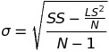

### Simple Statistics

Let the following data set be given (sample size 60):

4, 3, 2, 5, 4, 6, 3, 7, 4, 1, 4, 0, 6, 4, 3, 5, 2, 3, 5, 1, 4, 4, 9, 5, 4, 3, 3, 5, 2, 4, 3, 6, 5, 2, 6, 2, 4, 5, 5, 1, 5, 4, 4, 2, 7, 1, 3, 3, 4, 7, 3, 4, 4, 6, 6, 3, 3, 2, 6, 1.

Calculate:

- The mean
- The mean recursively
- The standard deviation over the sample

The calculation of the mean and the standard deviation of a list of numbers is fairly straightforward.


```python
import math

numbers = [4, 3, 2, 5, 4, 6, 3, 7, 4, 1, 4, 0, 6, 4, 3, 5, 2, 3, 5, 1, 4, 4, 9, 5, 4, 3, 3, 5, 2, 4, 3, 6, 5, 2, 6, 2, 4, 5, 5, 1, 5, 4, 4, 2, 7, 1, 3, 3, 4, 7, 3, 4, 4, 6, 6, 3, 3, 2, 6, 1]

# calculate mean
mean = sum(numbers) / len(numbers)

# calculate std dev
std_dev = math.sqrt(
    sum([(x - mean)**2 for x in numbers]) 
    / len(numbers)
)

print('Sample mean    : %0.2f' % mean)
print('Sample std dev : %0.2f' % std_dev)
```

    Sample mean    : 3.87
    Sample std dev : 1.77
    

However, in streaming environments, x is **unbounded**, which makes it necessary to calculate these simple statistics **incrementaly**.

To incrementally calculate the mean and standard deviation of a random variable x, we need to maintain three variables for x:

- **LS (Linear Sum)**
- **SS (Squared Sum)**
- **N (Count)**

This allows observations to be incrementally added.

- LS = LS + x<sub>i</sub>
- SS = SS + x<sub>i</sub><sup>2</sup>
- N = N + 1

As shown below, these three variables and their incremental additive properties are sufficient to calculate the mean and standard deviation of x in a streaming environment.


```python
class Stream:
    
    def __init__(self):
        self.ls = 0.0
        self.ss = 0.0
        self.n = 0.0
    
    def increment(self, x):
        """
        Add x to the observations by incrementing the sufficient stats
        """
        self.ls += x
        self.ss += x**2
        self.n += 1

    def decrement(self, x):
        """
        Remove x from the observations by decrementing the sufficient stats
        """
        self.ls -= x
        self.ss -= x**2
        self.n -= 1
    
    def mean(self):
        """
        Return mean of the observations by dividing LS by N
        """
        return self.ls/self.n
    
    def std_dev(self):
        """
        Return the standard deviation of the observations
        """
        return math.sqrt((self.ss/self.n) - (self.ls/self.n)**2)
    
    def print_stats(self):
        """
        Print the current values of the sufficient stats to the console
        """
        print('Linear Sum  : %0.2f' % self.ls)
        print('Squared Sum : %0.2f' % self.ss)
        print('N           : %0.2f' % self.n)
```

The mean can be calculated by:


And the standard deviation can be calculated by:



Below, we are incrementally adding three numbers to the sample, and calculating the mean and standard deviation of the observations in the stream


```python
stream = Stream()

stream.increment(4)
stream.increment(3)
stream.increment(2)

stream.print_stats()
print()
print('Mean: %0.2f' % stream.mean())
print('Standard Deviation: %0.2f' % stream.std_dev())
```

    Linear Sum  : 9.00
    Squared Sum : 29.00
    N           : 3.00
    
    Mean: 3.00
    Standard Deviation: 0.82
    

**Coming back to the original sample of 60 items:**

**4, 3, 2, 5, 4, 6, 3, 7, 4, 1, 4, 0, 6, 4, 3, 5, 2, 3, 5, 1, 4, 4, 9, 5, 4, 3, 3, 5, 2, 4, 3, 6, 5, 2, 6, 2, 4, 5, 5, 1, 5, 4, 4, 2, 7, 1, 3, 3, 4, 7, 3, 4, 4, 6, 6, 3, 3, 2, 6, 1.**

**Below, the items are incrementally added to the stream by updating the sufficient statistics, then the mean and standard deviation are printed.**


```python
stream = Stream()

for number in numbers:
    stream.increment(number)
stream.print_stats()
print()
print('Mean: %0.2f' % stream.mean())
print('Standard Deviation: %0.2f' % stream.std_dev())
```

    Linear Sum  : 232.00
    Squared Sum : 1086.00
    N           : 60.00
    
    Mean: 3.87
    Standard Deviation: 1.77
    
