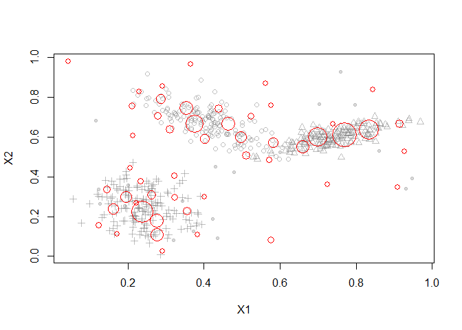
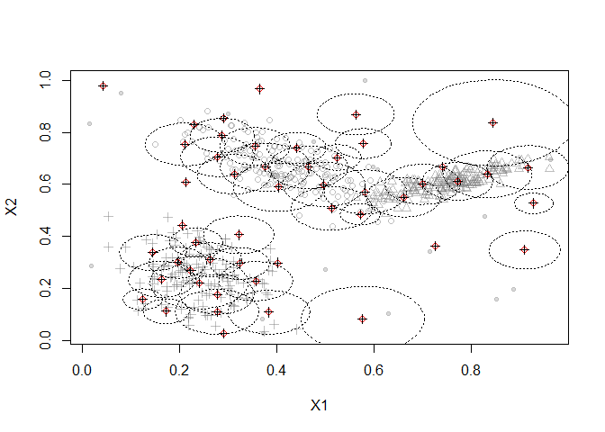
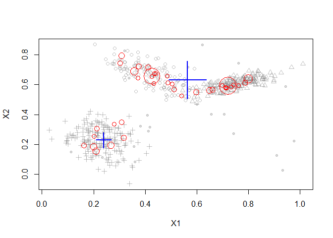

Stream Clustering Algorithms
================

## Clustream vs Denstream

The Clustream algorithm assumes the clusters are spherical in nature, so
it performs poorly when the clusters have arbitrary shapes. Denstream
overcomes this limitation since it uses a version of DBSCAN as the
offline clustering algorithm.

We are going to simulate a stream with 3 clusters consisting of
2-dimensional points.

Plotted below is a sample of 500 points from the stream. We can see that
there are 2 natural clusters and they are not circular.

## Clustream

After running the Clustream algorithm with 50 microclusters, the points
are summarized with microclusters

``` r
library("streamMOA")

stream <- DSD_Gaussians(k=3, d=2, noise=0.05)

# cluster with CluStream
clustream <- DSC_CluStream(m=50)
update(clustream, stream, 500)
clustream
```

    ## CluStream
    ## Class: moa/clusterers/clustream/WithKmeans, DSC_Micro, DSC_MOA, DSC 
    ## Number of micro-clusters: 50 
    ## Number of macro-clusters: 5

``` r
# plot micro-clusters
plot(clustream, stream)
```

<!-- -->

This plot shows the assignment area (radii) of the Micro-Clusters

``` r
# plot assignment area (micro-cluster radius)
plot(clustream, stream, assignment=TRUE, weights=FALSE)
```

<!-- -->

In the offline phase, the following clusters are found by K-Means

``` r
# reclustering. Use weighted k-means for CluStream
kmeans <- DSC_Kmeans(k=3, weighted=TRUE)
recluster(kmeans, clustream)
plot(kmeans, stream, type="both")
```

<!-- -->

## Denstream

Now we will use Denstream to cluster the same set of points. We notice
that Clustream has included a few outliers in its final clustering
result, wheras Denstream has correctly removed outliers, and was also
able to find arbitrary shaped clusters.

``` r
denstream <- DSC_DenStream(epsilon=0.05)
update(denstream, stream, 500)
plot(denstream, stream, type="both")
```

<!-- -->
